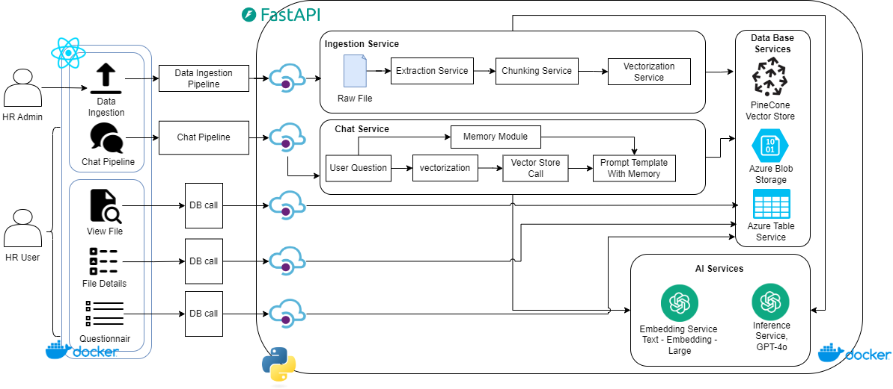

#  Getting Started with Resume Analyzer Python(Fast API) backend 

# Architecture Followed



The following is a rough architecture diagrm of the use case.

For running the FastAPI backend make sure you have python installed, I would recommend installing the 3.12 version as that's what I have used to develop. Python install: [python 3.12](https://www.python.org/downloads/release/python-3127/)

Once you're installed python, go ahead and create an environment in the APIs folder of the project. To create a .venv run the following command,  
`python -m venv .venv`\
if you're using VS code make sure that the appropriate environment python instance is selected and not the global install, to check just press `ctrl + shift + p` and check the python interpreter selection. 

After the appropriate environment is selected, run  `pip install -r requirements.txt` to install the requirements and dependencies needed for the project.

Once this is done, install Azurite from Microsoft Azure's website along with Azure storage Emulator and get the connection strings for the storage running locally with azurite, create a localconfig.yml file like so:
```ymal
database:
  connectionstrng: 
  containername: resumeshortlisterapp
vectorstore:
  pineconekey: 
  pineconeindex: interview-vectors
  pineconenamespace: interview-namespace
chunking:
  chunkstatagy: recursive
  chunksize: 800
  chunkoverlap: 200
openai:
  key:
  model: gpt-4o
  embeddingmodel: text-embedding-3-large
  vectordimensions: 3072
user:
  defaultuser: john.doe@software.tech
```

Along with this also get your OpenAI key, PineCone Vector namepace name and the API key. After all is successfully placed, toggle azurite from the command pallet. Also do not forget to set the CORS policy for the blob container that you wish to access/user.

Also as mentioned the readme for the front end, the backend also has its own docker file which can be used to create a docker image. 


